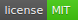

## Data Matrix svg generator [](/LICENSE)
Data Matrix generator written on pure javascript. Produces highly optimized SVG nodes.

[Data Matrix svg generator](https://datalog.github.io/demo/datamatrix-svg/) (Live demo)

## Easy to start
After `datamatrix.min.js` is downloaded and connected to your html5 page, call:
```javascript
var
svgNode = DATAMatrix('Hello World!');
```

All other options:
```javascript
var
svgNode = DATAMatrix({

     msg :  "Your message here"
    ,dim :   256
    ,rct :   0
    ,pad :   2
    ,pal : ["#000000", "#f2f4f8"]
    ,vrb :   0

});
```

## Options
* **msg** - Data Matrix ``message``, obviously, this is **mandatory parameter**.
* **rct** - set 1 to render rectangle Data Matrix if possible, default value is `0`.
* **dim** - is equal to needed dimention (height) in pixels, default value is `256`.
* **pad** - white space padding, default value is `2` blocks, set `0` for no padding.
* **pal** - is array of [`color`,`background-color`] strings that represent hex color codes, default value is [`'#000'`] along with transparent background. Set [`'#000'`,`'#fff'`] to make background opaque.
* **vrb** - svg node is optimized to be compact and default value is `0`, set this parameter to `1` in case you need more verbose output.
